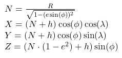
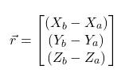
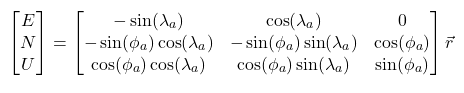
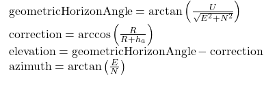

# Antenna Tracker

A new antenna tracker is being built that is larger. This code will be on it.

### Hardware:

- 2 Nema 17 Stepper Motors
- EASON Stepper Motor Driver TB6600
- Azimuth gear ratio: 1-0.0067 -> 149.2537-1
- Elevation gear ratio: ???
- Microcontroller: ELEGO Mega 2560 R3 -> ATMega2560 temp?
- GPS (on both tracker and balloon)
- Antenna Capable of LoRa
- Azimuth Turning Range: infinite?
- Elevation Turning Range: ??? 

### Wiring:
## INSERT IMAGE OF WIRES

### Explanation of Azimuth:

Azimuth is the angle relative to North (0 degrees).

### Method for Finding Angles:

We are given the longitude $(\lambda)$, latitude $(\phi)$, and altitude $(h)$ of both the antenna tracker and the balloon. 
$(\lambda_a, \phi_a, h_a), (\lambda_b, \phi_b, h_b)$ 
We also know Earth's radius $R = 6378137$ and Earth's eccentricity $e = 0.08181919$  
*Note: all calculations use units of radians and meters*

Using the Earth-Centered, Earth-Fixed (ECEF) coordinate system we find:  

The relative position is then:  

Now we can use a transformation matrix to convert to the ENU (East, North, Up) frame:

Using a line-of-sight geometric check:  

Accuracy:
- In extreme situations where the antenna is very high in the error: ±5°
- In more normal situations: ±3° (often within ±1°)

### Explanation of Motors

The Stepper.h library is compatiable with the Nema 17 motors but is not capable of microstepping. This is 
currently okay because 1 motor step results in a fraction of degree of movement for the antenna. Since
the above angle method is not that accurate using microsteps would be pointless. 

Accuracy:
- Nema 17 Motors have a step accuracy of: ±5% -> ±0.011° 

### Explanation of GPS

Module on both plane and antenna.
What are the accuracy of these modules.

### Explanation of LoRa

Innacuracy due to time

### Future Improvements

- Our total accuracy is currently...
- 
