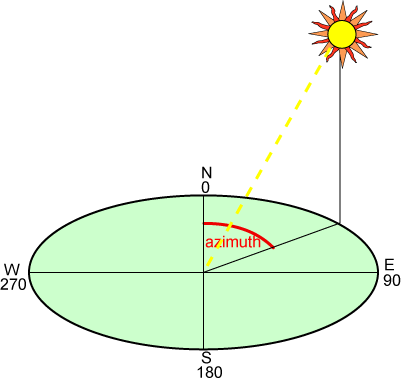
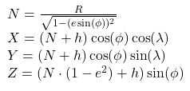
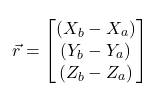
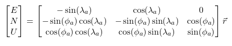
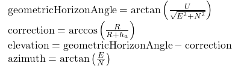

# Antenna Tracker

A new antenna tracker is being built that is larger. This code will be on it.

### Hardware:

- 2 Nema 22 Stepper Motors
- Azimuth gear ratio: ??? ("Around 150-1")
- Elevation gear ratio: ???
- Microcontroller: ??? (Esp32, RaspberryPi, no one knows)
- GPS (on both tracker and balloon)
- Antenna Capable of LoRa
- Turning Ranges: ???

### Explanation of Azimuth:

Azimuth is the angle relative to North (0 degrees).

### Method for Finding Angles:

We are given the longitude $(\lambda)$, latitude $(\phi)$, and altitude $(h)$ of both the antenna tracker and the balloon. 
$(\lambda_a, \phi_a, h_a), (\lambda_b, \phi_b, h_b)$ 
We also know Earth's radius $R = 6378137$ and Earth's eccentricity $e = 0.08181919$  
*Note: all calculations use units of radians and meters*

Using the Earth-Centered, Earth-Fixed (ECEF) coordinate system we find:  

The relative position is then:  

Now we can use a transformation matrix to convert to the ENU (East, North, Up) frame:

Using a line-of-sight geometric check:
